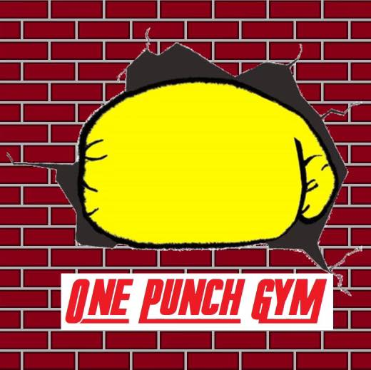

<!DOCTYPE html>
<html lang="en">
<head>
    <meta charset="UTF-8">
    <meta name="viewport" content="width=device-width, initial-scale=1.0">
    <title>One Punch Gym</title>
    
</head>
<body>
    <header>
        

            
        

        <h1>Welcome to One Punch Gym</h1>
        
Your path to empowerment through martial arts and fitness starts here!

    </header>
    

        
At One Punch Gym, we offer a range of martial arts and fitness programs designed to build strength, confidence, and community.

        
Check out our classes, schedule, and how to get started with us today!

    

</body>
</html>

